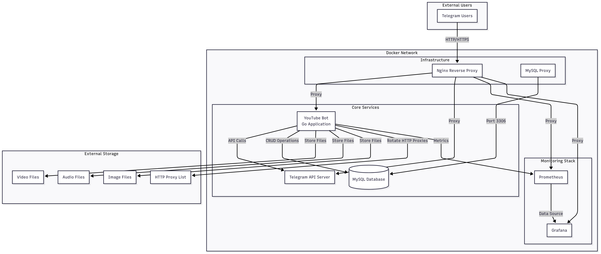
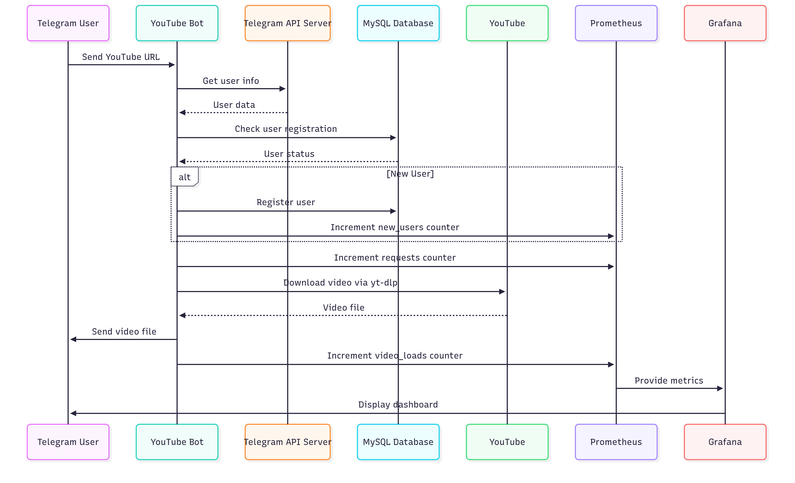

# YouTube Bot - Telegram Video Downloader with Monitoring

A comprehensive Telegram bot for downloading YouTube videos with full monitoring stack, built with Go and Docker.

## 🏗️ Architecture Overview



## 🚀 Quick Start

### Prerequisites
- Docker and Docker Compose
- Go 1.19+ (for development)
- MySQL client (optional)

### 1. Environment Setup

```bash
# Create environment file
chmod +x create-env.sh
./create-env.sh

# Edit .env with your values
nano .env
```

Required environment variables:
```bash
TELEGRAM_API_TOKEN=your_telegram_bot_token
TELEGRAM_API_ID=your_api_id
TELEGRAM_API_HASH=your_api_hash
DB_LOGIN=youtube_user
DB_PASSWORD=your_secure_password
DB_HOST=mysql
DB_PORT=3306
DB_NAME=youtube_bot
PATH_TO_PROXY=/path/to/proxy
PATH_TO_LOAD_VIDEO=/path/to/videos
PATH_TO_LOAD_AUDIO=/path/to/audio
PATH_TO_LOAD_IMG=/path/to/images
```

### 2. Start Services

```bash
chmod +x start.sh
./start.sh
```

### 3. Access Services

| Service | URL | Credentials |
|---------|-----|-------------|
| **YouTube Bot API** | http://localhost:8090 | - |
| **Telegram Bot API** | http://localhost:8081 | - |
| **Prometheus** | http://localhost:9090 | - |
| **Grafana** | http://localhost:3000 | admin/admin |
| **MySQL** | localhost:3306 | admin/admin |

## 📊 System Architecture

### Service Interaction Flow



## 🔧 Core Components

### 1. YouTube Bot (Go Application)

**Location**: `internal/app/server.go`

Key features:
- Telegram bot message handling
- YouTube video downloading via yt-dlp
- User registration and management
- Prometheus metrics collection
- HTTP proxy rotation support

**Metrics collected**:
- `requests_total` - Total request count
- `register_users_total` - New user registrations
- `video_loads` - Successful video downloads
- `video_loads_error` - Failed downloads

### 2. Telegram Bot API Server

**Image**: `aiogram/telegram-bot-api:latest`

Provides local Telegram Bot API for:
- Improved performance
- Better rate limiting control
- Offline operation capability

### 3. MySQL Database

**Image**: `mysql:8.0`

Features:
- Automatic schema import on first run
- Native password authentication for compatibility
- Persistent data storage
- User management and request tracking

### 4. Monitoring Stack

#### Prometheus
- **Configuration**: `prometheus.yml`
- **Scrape interval**: 15 seconds
- **Retention**: 200 hours
- **Targets**: YouTube Bot metrics endpoint

#### Grafana
- **Default credentials**: admin/admin
- **Dashboards**: Auto-provisioned
- **Data source**: Prometheus
- **Refresh rate**: 5 seconds

### 5. Nginx Reverse Proxy

**Configuration**: `nginx/nginx.conf`

Features:
- IP-based access control
- SSL termination (configurable)
- Load balancing
- Request routing

## 📈 Monitoring & Metrics

### Prometheus Metrics

```yaml
# Available Metrics
requests_total: "Total number of bot requests"
register_users_total: "Total number of user registrations"
video_loads: "Total number of successful video downloads"
video_loads_error: "Total number of failed video downloads"
```

### Grafana Dashboard

The system includes a pre-configured dashboard with:

1. **Total Requests** - Real-time request counter
2. **New Users Registration** - User growth tracking
3. **Requests Rate** - Request per second graph
4. **Video Download Success Rate** - Success/failure ratio

## 🔒 Security Features

### HTTP Proxy Configuration

The bot uses HTTP proxies for downloading YouTube videos to avoid rate limiting and IP blocking. The proxy system provides:

- **Automatic proxy rotation** - Each download request uses a different proxy
- **Load balancing** - Distributes requests across multiple proxy servers
- **Failover support** - Automatic switching to next proxy on failure
- **Authentication** - Supports username/password authentication

#### Proxy File Format

The proxy configuration is stored in `proxy_files/proxy.txt` with the following format:

```
username:password:ip_address:port
```

**Example:**
```
o4Ppc7:T5Gw1a:70.38.2.19:12802
o4Ppc7:T5Gw1a:70.38.2.19:12803
o4Ppc7:T5Gw1a:70.38.2.19:12804
```

**Format Details:**
- **username** - Proxy authentication username
- **password** - Proxy authentication password  
- **ip_address** - Proxy server IP address
- **port** - Proxy server port number

#### Proxy Rotation Logic

The system implements round-robin proxy rotation:

1. **Sequential Selection** - Proxies are used in order from the file
2. **Reset Cycle** - When reaching the end, rotation starts from the first proxy
3. **Automatic Failover** - If a proxy fails, the system automatically tries the next one
4. **Load Distribution** - Each new download request gets a different proxy

#### Configuration

Set the proxy file path in your `.env` file:

```bash
PATH_TO_PROXY=/path/to/proxy_files/proxy.txt
```

The proxy file is mounted into the container at `/root/proxy_files/proxy.txt`.

### IP Access Control

```nginx
# Allowed IP ranges
geo $allowed_ip {
    default 0;
    111.111.111.111 1;  # Your VPN IP
    127.0.0.1 1;        # localhost
    10.0.0.0/8 1;       # Internal networks
    172.16.0.0/12 1;    # Docker networks
    192.168.0.0/16 1;   # Local networks
}
```

### Service Isolation

- All services run in isolated Docker network
- External access only through Nginx proxy
- Database access restricted to internal network
- SSL/TLS encryption support

### Authentication

- MySQL native password authentication
- Grafana admin credentials
- Telegram Bot API token protection


### Scaling Considerations

- **Horizontal Scaling**: Add multiple YouTube Bot instances behind load balancer
- **Database Scaling**: Use MySQL replication or clustering
- **Storage Scaling**: Implement distributed file storage
- **Monitoring Scaling**: Add Prometheus federation for multiple instances

## 🛠️ Development

### Local Development Setup

```bash
# Clone repository
git clone <repository-url>
cd youtube_bot

# Install dependencies
go mod download

# Run locally
go run cmd/main.go
```

### Testing

```bash
# Test database connection
./scripts/test-db-connection.sh

# Test Telegram API
./scripts/check-telegram-api.sh

# Test external MySQL access
./scripts/test-external-mysql.sh
```

### Debugging

```bash
# View logs
docker-compose logs -f youtube-bot

# Access container shell
docker-compose exec youtube-bot sh

# Check metrics endpoint
curl http://localhost:8090/metrics
```

## 📋 API Endpoints

### YouTube Bot API

| Endpoint | Method | Description |
|----------|--------|-------------|
| `/metrics` | GET | Prometheus metrics |


## 🔄 Backup & Recovery

### Automated Backup

```bash
# Create backup
./scripts/backup-mysql.sh

# List backups
./scripts/list-backups.sh

# Restore from backup
./scripts/restore-mysql.sh ./backups/backup_2024-01-01.sql
```

## 🧹 Maintenance

### Automated Cleanup

The system automatically cleans temporary files:

- **Interval**: Every 2 hours
- **Age threshold**: Files older than 2 hours
- **Directories**: `/tmp/videos`, `/tmp/audio`, `/tmp/images`
- **Protected**: Proxy files and system files

### Manual Cleanup

```bash
# Clean temporary files
./scripts/cleanup-temp.sh

# Check disk usage
docker system df
```

## 🐛 Troubleshooting

### Common Issues

1. **Bot not responding**
   ```bash
   # Check bot logs
   docker-compose logs youtube-bot
   
   # Verify Telegram token
   curl "https://api.telegram.org/bot<TOKEN>/getMe"
   ```

2. **Database connection issues**
   ```bash
   # Test database connection
   ./scripts/test-db-connection.sh
   
   # Check MySQL logs
   docker-compose logs mysql
   ```

3. **Video download failures**
   ```bash
   # Check proxy configuration
   cat proxy_files/proxy.txt
   
   # Test proxy connectivity
   docker-compose exec youtube-bot curl --proxy http://username:password@ip:port http://httpbin.org/ip
   
   # Test yt-dlp with proxy
   docker-compose exec youtube-bot yt-dlp --proxy http://username:password@ip:port --version
   
   # Check proxy rotation
   docker-compose logs youtube-bot | grep -i "proxy"
   ```

4. **Proxy-related issues**
   ```bash
   # Verify proxy file format
   head -5 proxy_files/proxy.txt
   
   # Test individual proxy
   curl --proxy http://username:password@ip:port http://httpbin.org/ip
   
   # Check proxy rotation in logs
   docker-compose logs youtube-bot | grep -i "proxy"
   
   # Validate proxy authentication
   docker-compose exec youtube-bot sh -c "cat /root/proxy_files/proxy.txt"
   ```

## 📚 Additional Resources

- [Telegram Bot API Documentation](https://core.telegram.org/bots/api)
- [yt-dlp Documentation](https://github.com/yt-dlp/yt-dlp)
- [Prometheus Documentation](https://prometheus.io/docs/)
- [Grafana Documentation](https://grafana.com/docs/)

---

**Note**: This README provides a comprehensive overview of the YouTube Bot system. For specific implementation details, refer to the individual component documentation and source code.
